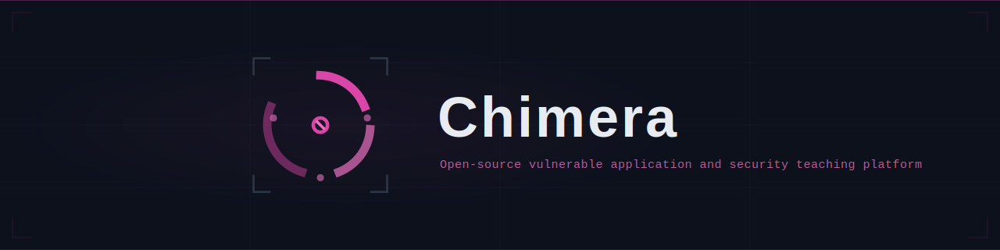

<p align="center">
  
</p>

<p align="center">
  <a href="https://pypi.org/project/chimera-api/"></a>
  <a href="https://www.python.org/downloads/"></a>
  <a href="LICENSE"></a>
  <a href="docs/vulnerability-inventory.md"></a>
</p>

An intentionally vulnerable monorepo for WAF testing and security education. Chimera bundles a Flask API with **456+ vulnerable endpoints** across **25+ industry domains** and a React portal frontend into a single installable package.

> **Warning**: This application contains deliberate security vulnerabilities. Never deploy to production or expose to the internet without proper WAF protection.

## Features

- **456+ vulnerable endpoints** spanning 25+ industry verticals — banking, healthcare, e-commerce, telecom, energy/SCADA, government, and more
- **Full OWASP Top 10 coverage** with 200+ intentional vulnerabilities including injection, broken auth, IDOR, SSRF, business logic flaws, and more
- **Interactive React portal** with industry-themed dashboards, a red team console, attack visualizations, and guided exploit walkthroughs
- **Single `pip install`** — the React SPA is bundled into the Python wheel, so one command gets you a fully functional target environment
- **Flexible demo modes** — run fully vulnerable or with dangerous endpoints blocked; optionally enable real SQLite for true SQL injection
- **Built-in Swagger UI** at `/swagger` for interactive API exploration
- **Load testing & scanning** — includes k6 scenarios and Nuclei templates out of the box
- **Observability stack** — pre-built Grafana dashboards and Loki log shipping configuration

## Quick Start

### Install from PyPI

```bash
pip install chimera-api
chimera-api --port 8880 --demo-mode full
```

Open [http://localhost:8880](http://localhost:8880) for the web portal, or [http://localhost:8880/swagger](http://localhost:8880/swagger) for the interactive API docs.

### Docker

```bash
docker build -t chimera-api apps/vuln-api
docker run -p 8880:80 -e DEMO_MODE=full chimera-api
```

### Local Development

Prerequisites: **Node.js 18+**, **pnpm**, **Python 3.12+**, **[uv](https://docs.astral.sh/uv/)**, **[just](https://just.systems/)**

```bash
# Install workspace dependencies
pnpm install
cd apps/vuln-api && uv sync --extra dev && cd ../..

# Start both the API and web dev servers
just dev
```

| Service | URL |
|---------|-----|
| API | [http://localhost:5000](http://localhost:5000) |
| Swagger UI | [http://localhost:5000/swagger](http://localhost:5000/swagger) |
| Web Portal | [http://localhost:5175](http://localhost:5175) |

The Vite dev server proxies `/api` requests to the Flask backend automatically.

## Architecture

Chimera is a **pnpm + Nx monorepo** with two main applications that can run independently in development or be bundled together for production distribution.

```
Chimera/
├── apps/
│   ├── vuln-api/              # Flask API (Python 3.12, Gunicorn + gevent)
│   │   ├── app/
│   │   │   ├── blueprints/    # 25+ domain-specific route modules
│   │   │   ├── models/        # In-memory data stores + optional SQLite
│   │   │   ├── web_dist/      # Bundled React SPA (populated at build time)
│   │   │   └── cli.py         # CLI entry point (`chimera-api` command)
│   │   └── tests/             # pytest suite with vulnerability markers
│   └── vuln-web/              # React 18 SPA (TypeScript, Vite, Tailwind CSS)
│       └── src/
│           ├── pages/         # Industry-specific dashboards
│           └── components/    # Red team console, WAF visualizer, kill chain tracker
├── k6/                        # Load testing scenarios
├── nuclei-templates/          # Vulnerability scanning templates
├── observability/             # Grafana + Loki dashboards
├── justfile                   # Task runner (preferred entry point)
└── nx.json                    # Monorepo orchestration
```

### Build Pipeline

The production build bundles the React SPA directly into the Python wheel, so a single `pip install` delivers the entire application:

```
just bundle
  → Vite builds the React SPA into apps/vuln-api/app/web_dist/
  → hatchling packages everything into a Python wheel
  → chimera-api serves the SPA alongside the API from a single process
```

## Industry Domains

| Domain | Endpoints | Examples |
|--------|-----------|---------|
| E-commerce | 48 | Cart manipulation, checkout, gift cards, price tampering |
| Insurance | 42 | Policy management, claims fraud, underwriting bypass |
| Healthcare | 31 | HIPAA records, PHI exposure, claims processing |
| Auth | 30 | JWT confusion, MFA bypass, API key leakage, session hijacking |
| SaaS | 30 | Multi-tenant isolation, SAML injection, billing manipulation |
| Banking | 29 | Wire transfers, account takeover, KYC bypass |
| Government | 28 | Citizen services, benefits fraud, identity access |
| Attack Sim | 25 | Red team simulation, exploit chains |
| Telecom | 23 | SIM swaps, CDR exports, number porting |
| Energy | 23 | SCADA dispatch, meter readings, grid control |
| Payments | 18 | Card processing, refund abuse, merchant onboarding |
| Infrastructure | 18 | Cloud secrets, SSRF, metadata service access |
| Compliance | 16 | AML monitoring, sanctions screening, audit trails |
| Mobile | 15 | Biometric bypass, certificate pinning, device trust |
| Loyalty | 14 | Points manipulation, reward fraud |
| Integrations | 13 | Webhooks, SSRF targets, third-party abuse |
| Checkout | 12 | Payment flow tampering, coupon stacking |
| ICS/OT | 10 | Industrial control systems, operational technology |
| Admin | — | User management, system configuration |
| GenAI | 4 | Prompt injection, AI chat exploitation |
| *+ others* | | Diagnostics, testing, throughput, recording |

## Vulnerability Coverage

Chimera covers **100% of the OWASP Top 10** with 200+ intentional vulnerabilities:

| Category | Examples |
|----------|----------|
| **Injection** | SQL injection, command injection, XXE, LDAP injection, template injection |
| **Broken Authentication** | JWT algorithm confusion, token forgery, credential stuffing, session fixation |
| **Sensitive Data Exposure** | SSN/credit card leakage, PHI in responses, API keys in headers |
| **Broken Access Control** | IDOR, missing authorization, privilege escalation, forced browsing |
| **Security Misconfiguration** | Debug endpoints, verbose errors, permissive CORS, default credentials |
| **Business Logic Flaws** | Race conditions, price manipulation, negative quantities, replay attacks |
| **SSRF** | Internal network scanning, cloud metadata access, webhook abuse |
| **Cryptographic Failures** | Weak hashing, predictable tokens, insecure key storage |

See the full [Vulnerability Inventory](docs/vulnerability-inventory.md) for detailed descriptions and exploit examples.

## Configuration

### Demo Modes

| Mode | Value | Behavior |
|------|-------|----------|
| **Full** | `DEMO_MODE=full` | All vulnerabilities active — use for WAF testing |
| **Strict** | `DEMO_MODE=strict` | Dangerous endpoints return `403` — safe for demos |

### Environment Variables

| Variable | Default | Description |
|----------|---------|-------------|
| `DEMO_MODE` | `strict` | `full` enables all vulnerabilities; `strict` blocks dangerous endpoints |
| `USE_DATABASE` | `false` | Enable SQLite backend for real SQL injection testing |
| `DATABASE_PATH` | `demo.db` | SQLite file location (when `USE_DATABASE=true`) |
| `PORT` | `80` (container) / `5000` (dev) | Server listening port |
| `DEMO_THROUGHPUT_MODE` | `false` | Enable high-throughput testing endpoints |

### CLI Options

```bash
chimera-api --help

chimera-api \
  --host 0.0.0.0 \
  --port 8880 \
  --demo-mode full \
  --debug
```

## Commands

All commands are available through `just` (preferred) or directly via `pnpm nx`.

```bash
just                     # List all available recipes
just dev                 # Start API + web dev servers concurrently
just build               # Build all projects
just test                # Run all tests
just lint                # Lint all projects
just bundle              # Build React SPA + Python wheel

just api-test            # Run API tests (pytest)
just api-test-unit       # Run API unit tests directly

just web-dev             # Start web dev server only
just web-build           # Production build of the web app
just web-test            # Run web tests (vitest)
just web-lint            # Lint the web app

just bundle-web          # Build React SPA into Flask package
just build-api           # Build Python wheel (auto-bundles web first)
just publish-api         # Publish chimera-api to PyPI

just graph               # Show the Nx dependency graph
just affected            # Test only changed projects
```

## Testing

### API (pytest)

```bash
just api-test                              # Full suite via Nx
make -C apps/vuln-api test-unit            # Unit tests with coverage
make -C apps/vuln-api test-quick           # Fast feedback (fail-fast)
make -C apps/vuln-api test-vulnerability   # Security-specific tests
make -C apps/vuln-api test-smoke           # Smoke tests
```

Coverage target: **80% minimum**.

### Web (vitest)

```bash
just web-test             # Run component and hook tests
```

### Security Scanning

```bash
# Nuclei vulnerability scanning (requires nuclei CLI)
nuclei -t nuclei-templates/ -u http://localhost:8880

# k6 load testing
k6 run k6/scenarios/<scenario>.js
```

## Documentation

| Document | Description |
|----------|-------------|
| [Architecture](docs/architecture.md) | System diagrams, request flow, CSP strategy |
| [API Reference](docs/api-reference.md) | Endpoint catalog organized by domain |
| [Developer Guide](docs/developer-guide.md) | Setup, testing, contributing, adding new domains |
| [Vulnerability Inventory](docs/vulnerability-inventory.md) | Full catalog of 200+ intentional flaws |
| [Endpoints Catalog](docs/endpoints-catalog.md) | Complete endpoint listing with methods and headers |

## Contributing

1. Fork the repository
2. Create a feature branch (`git checkout -b feat/new-domain`)
3. Follow [Conventional Commits](https://www.conventionalcommits.org/) — `feat(api):`, `fix(web):`, `docs:`
4. Add tests for new endpoints (pytest markers: `@pytest.mark.vulnerability` for security tests)
5. Ensure `just test` and `just lint` pass
6. Open a pull request

See the [Developer Guide](docs/developer-guide.md) for detailed instructions on adding new industry domains and vulnerability types.

## License

[MIT](LICENSE) — Copyright (c) 2026 Nicholas Ferguson
